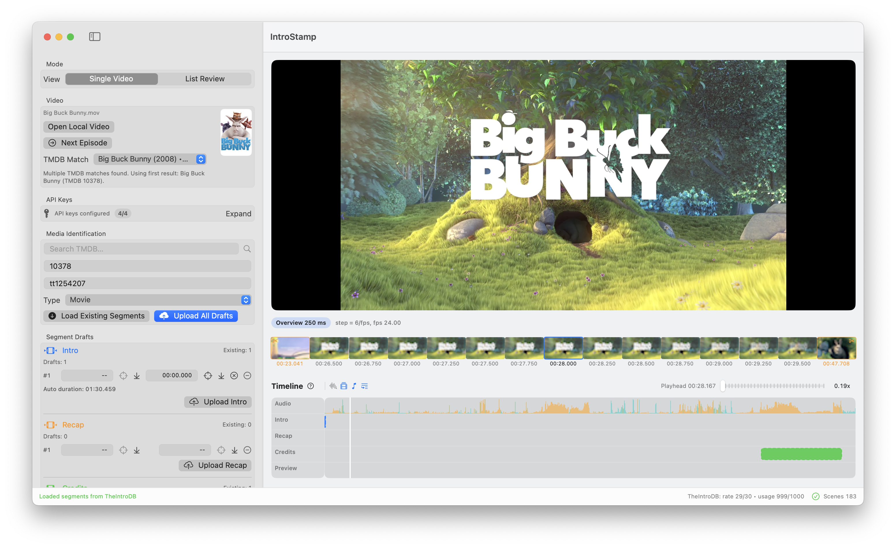
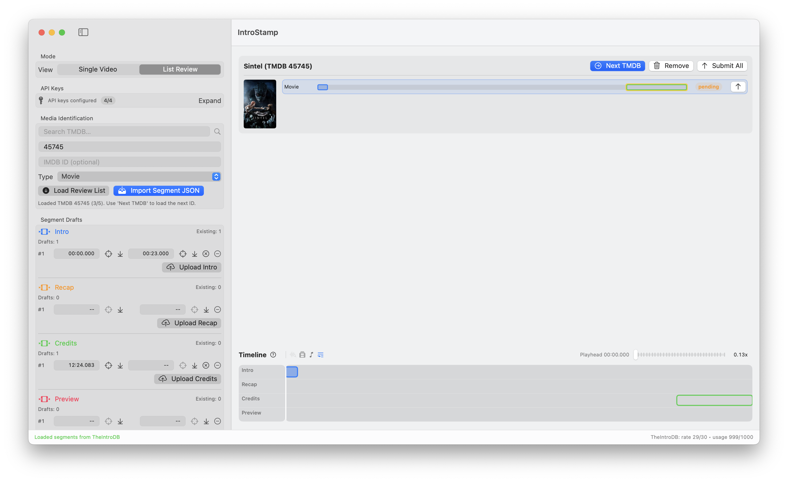

# IntroStamp

[](https://www.apple.com/macos)
[](https://swift.org)
[](LICENSE)

IntroStamp is a macOS app for creating and uploading segment markers for Intro, Recap, Credits / Outro, and Preview.

It provides timeline-based annotation with synchronized video, frame strip, and audio timeline.

## Features

- Local video loading with timeline-based segment editing
- Filename-based auto-detection plus TMDB search fallback
- Audio density track with music-likelihood color cues
- Scene-cut detection with thumbnail-assisted boundary work
- Recap detection via local SRT/ASS subtitles or OpenSubtitles
- Non-overlapping multi-segment draft workflow with no-segment flags per type
- Single-segment or bulk upload to TheIntroDB and IntroDB
- API keys and service credentials stored in macOS Keychain
- Review mode for batch validation and correction across multiple items
- JSON review import from submission backups or compatible segment payloads
- Export submission backup JSON for all submitted items via the toolbar
- Logging of segment submissions

## Screenshot



## Installation

### GitHub Release

1. Download the latest asset from [Releases](https://github.com/fetchbot/introstamp/releases/latest):
	- `IntroStamp-local-arm64.zip` for Apple Silicon
	- `IntroStamp-local-x86_64.zip` for Intel
	- `IntroStamp-local-universal.zip` for either architecture (larger file size)
2. Unzip and move `IntroStamp.app` to `/Applications`.
3. Start the app.

> Note:  
> Current release asset is ad-hoc signed and not notarized.  
> On first launch, macOS Gatekeeper may show a warning.  
> Open System Settings: `Privacy & Security` -> under blocked apps click `Open Anyway`.

## Workflow Segment Drafting

1. Open a local video file.
2. Confirm media identification (auto-detected or manual TMDB search).
3. Automatic load of existing segments (TheIntroDB / IntroDB, depending on compatibility and configured keys).
4. Create and adjust drafts on the timeline, including no-segment flags if needed.
5. Optionally run audio likelihood, scene-cut, or recap detection to accelerate drafting.
6. Upload one segment type or all drafts.

## Workflow Review List

1. Import a submission backup JSON (or compatible JSON lines/object payload). Or search for a TMDB ID to fetch existing segments from TheIntroDB or IntroDB.
2. Review each item for segments.
3. Select list item, inspect with jump controls, and refine boundaries.
4. Submit the row (or a full group).



## Backup Submission History

1. Select `Backup ... Submissions` from the toolbar under `Tools` to export a JSON file with all submitted items.
2. Copy and paste the clerk token request/response from the browser's network log as a cURL command into the text input field.
3. Click `Backup` to load and save the submission history as a JSON file.

## Timeline UX

- Synchronized video player, frame strip, and audio timeline
- Non-overlapping segment logic across types
- Drag to resize or move segments between rows
- Undo and redo support for segment changes
- Vertical scroll zoom with playhead-focused editing
- Scope icon in draft rows to jump playhead to a segment boundary
- Click on frame strip to jump to selected frame or scene-cut

## Optional Video Analysis

### Audio Density Track

- Audio bars visualize density over time.
- Color indicates music likelihood:
- Mint: low music probability (speech/dialogue-like)
- Orange: high music probability (theme songs and music-heavy parts)

### Scene-Cut Detection

- Detects scene transitions and displays them in the frame strip to the left and right of the playhead position.
- Jump to previous/next scene-cut with <kbd>⇧</kbd> + <kbd>←</kbd> / <kbd>⇧</kbd> + <kbd>→</kbd>.

### Recap Detection

- Detects recap segments based on local SRT/ASS subtitle files or OpenSubtitles.
- Displays detected recap segments in the timeline for review and adjustment.
- Matches are based on subtitle timing and content analysis.
- Subtitles are compared from the current episode to the previous one.

## Keyboard Shortcuts

### Draft Editing

| Action | Shortcut |
|---|---|
| Intro start / end / no-intro | <kbd>I</kbd> / <kbd>⇧</kbd> + <kbd>I</kbd> / <kbd>⌥</kbd> + <kbd>I</kbd> |
| Recap start / end / no-recap | <kbd>R</kbd> / <kbd>⇧</kbd> + <kbd>R</kbd> / <kbd>⌥</kbd> + <kbd>R</kbd> |
| Credits start / end / no-credits | <kbd>C</kbd> / <kbd>⇧</kbd> + <kbd>C</kbd> / <kbd>⌥</kbd> + <kbd>C</kbd> |
| Preview start / end / no-preview | <kbd>P</kbd> / <kbd>⇧</kbd> + <kbd>P</kbd> / <kbd>⌥</kbd> + <kbd>P</kbd> |
| Move nearest boundary to playhead | <kbd>,</kbd> |

### Jump Navigation

| Action | Shortcut |
|---|---|
| Next Intro start / end | <kbd>⌘</kbd> + <kbd>I</kbd> / <kbd>⌘</kbd> + <kbd>⇧</kbd> + <kbd>I</kbd> |
| Next Recap start / end | <kbd>⌘</kbd> + <kbd>R</kbd> / <kbd>⌘</kbd> + <kbd>⇧</kbd> + <kbd>R</kbd> |
| Next Credits start / end | <kbd>⌘</kbd> + <kbd>C</kbd> / <kbd>⌘</kbd> + <kbd>⇧</kbd> + <kbd>C</kbd> |
| Next Preview start / end | <kbd>⌘</kbd> + <kbd>P</kbd> / <kbd>⌘</kbd> + <kbd>⇧</kbd> + <kbd>P</kbd> |
| Previous / next scene transition | <kbd>⇧</kbd> + <kbd>←</kbd> / <kbd>⇧</kbd> + <kbd>→</kbd> |
| Open next episode/file | <kbd>⌘</kbd> + <kbd>⇧</kbd> + <kbd>N</kbd> |

### Boundary Nudging

| Action | Shortcut |
|---|---|
| Nudge nearest boundary by 1 frame | <kbd>⌘</kbd> + <kbd>←</kbd> / <kbd>⌘</kbd> + <kbd>→</kbd> |
| Nudge nearest boundary by 1 second | <kbd>⌥</kbd> + <kbd>←</kbd> / <kbd>⌥</kbd> + <kbd>→</kbd> |

### Undo / Redo

| Action | Shortcut |
|---|---|
| Undo | <kbd>⌘</kbd> + <kbd>Z</kbd> |
| Redo | <kbd>⌘</kbd> + <kbd>⇧</kbd> + <kbd>Z</kbd> |

## Requirements

- macOS 15.0+
- Xcode 16.0+
- Swift 6.0+

## Quick Start

1. Clone the repository and open the project.

```bash
git clone https://github.com/fetchbot/introstamp.git
cd IntroStamp
open IntroStamp.xcodeproj
```

2. Select the `IntroStamp` scheme.
3. Run with `⌘R`.

## API Keys

The app uses four APIs/keys:

- TheIntroDB API key (Bearer): optional authenticated fetch behavior, upload support for movie+tv and all segment types.
- IntroDB API key (`X-API-Key`): optional fetch/upload support for TV episodes (`imdb_id` + season + episode), segments intro/recap/outro.
- TMDB API key: used for filename-based auto lookup and manual search.
- OpenSubtitles API key: used for online subtitle-based recap detection (optional when working only with local subtitle files).

Set any available keys in the sidebar API section and save them to Keychain.

Backend selection:

- Fetch: queries TheIntroDB and IntroDB in parallel when compatible. Timeline display is segment-wise: TheIntroDB is primary, IntroDB is fallback when a segment is missing.
- Upload: sends requests in parallel to all compatible services. If both services are configured, both are used.
- IntroDB mapping: app segment `credits` maps to IntroDB `outro` (no `preview`).

## Development

```bash
xcodebuild -project IntroStamp.xcodeproj -scheme IntroStamp -destination 'platform=macOS' build
```

### Test

```bash
xcodebuild -project IntroStamp.xcodeproj -scheme IntroStamp -destination 'platform=macOS' test
```

Regenerate scenario tests from the CSV source:

```bash
swift scripts/generate_segment_tests.swift
```

## Release (Local, No Developer Program)

```bash
./scripts/release_local_no_dev_program.sh
```

Artifacts are written to build/local-release. This build is ad-hoc signed and not notarized.

Local release script outputs:

- IntroStamp-local-arm64.zip (+ .sha256)
- IntroStamp-local-x86_64.zip (+ .sha256)
- IntroStamp-local-universal.zip (+ .sha256)

## License

MIT License. See [LICENSE](LICENSE).

## Credits

- [TheIntroDB](https://theintrodb.org) and [IntroDB](https://introdb.app) for segment data APIs.
- [TMDB](https://www.themoviedb.org) for metadata and posters.
- [OpenSubtitles](https://www.opensubtitles.org) for subtitle-based recap detection.
