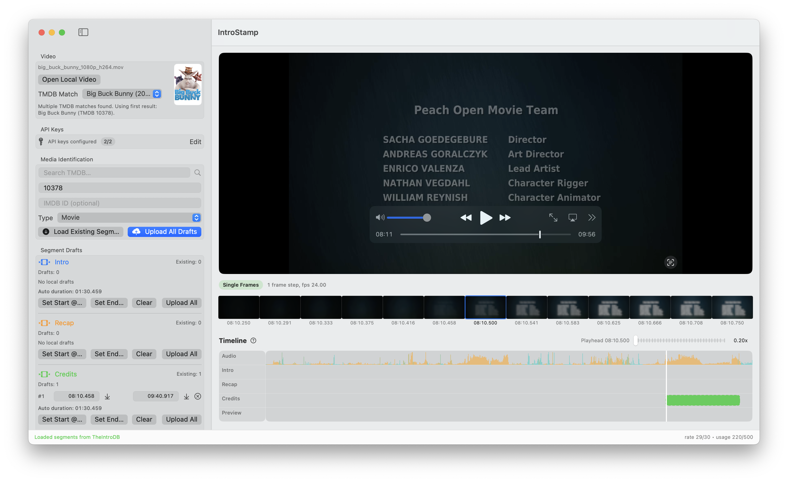

# IntroStamp

[](https://www.apple.com/macos)
[](https://swift.org)
[](LICENSE)

IntroStamp is a macOS app for creating and uploading segment markers for Intro, Recap, Credits, and Preview.

It provides timeline-based annotation with synchronized video, frame strip, and audio timeline.

## Features

- Local video loading with timeline-based segment editing
- Audio density track with music-likelihood color cues
- Filename-based auto-detection plus TMDB search fallback
- TMDB results enriched with IMDb IDs for faster TV workflow
- Non-overlapping multi-segment draft workflow
- Single-segment or bulk upload to TheIntroDB and IntroDB
- API keys stored in macOS Keychain

## Screenshot



## Installation

### GitHub Release

1. Download the latest asset from [Releases](https://github.com/fetchbot/introstamp/releases/latest):
	- `IntroStamp-local-arm64.zip` for Apple Silicon
	- `IntroStamp-local-x86_64.zip` for Intel
	- `IntroStamp-local-universal.zip` for either architecture (larger file size)
2. Unzip and move `IntroStamp.app` to `/Applications`.
3. Start the app.

> Note:  
> Current release asset is ad-hoc signed and not notarized.  
> On first launch, macOS Gatekeeper may show a warning.  
> Open System Settings: `Privacy & Security` -> under blocked apps click `Open Anyway`.

## Workflow

1. Open a local video file.
2. Confirm media identification (auto-detected or manual TMDB search).
3. Load existing segments from TheIntroDB.
4. Create and adjust drafts on the timeline.
5. Upload one segment type or all drafts.

## Timeline UX

- Synchronized video player, frame strip, and audio timeline
- Non-overlapping segment logic across types
- Drag to resize or move segments between rows
- Undo and redo support for segment changes
- Vertical scroll zoom with playhead-focused editing
- Scope icon in draft rows to jump playhead to a segment boundary

### Audio Timeline and Music Detection

- Audio bars visualize density over time.
- Color indicates music likelihood:
- Mint: low music probability (speech/dialogue-like)
- Orange: high music probability (theme songs and music-heavy parts)

## Keyboard Shortcuts

| Segment | Start | End |
|---|---|---|
| Intro | <kbd>I</kbd> | <kbd>Shift</kbd> + <kbd>I</kbd> |
| Recap | <kbd>R</kbd> | <kbd>Shift</kbd> + <kbd>R</kbd> |
| Credits | <kbd>C</kbd> | <kbd>Shift</kbd> + <kbd>C</kbd> |
| Preview | <kbd>P</kbd> | <kbd>Shift</kbd> + <kbd>P</kbd> |
| Nearest Boundary | <kbd>,</kbd> | Move nearest segment boundary to playhead |

## Requirements

- macOS 15.0+
- Xcode 16.0+
- Swift 6.0+

## Quick Start

1. Clone the repository and open the project.

```bash
git clone https://github.com/fetchbot/introstamp.git
cd IntroStamp
open IntroStamp.xcodeproj
```

2. Select the `IntroStamp` scheme.
3. Run with `Cmd + R`.

## API Keys

The app uses three APIs/keys:

- TheIntroDB API key (Bearer): optional authenticated fetch behavior, upload support for movie+tv and all segment types.
- IntroDB API key (`X-API-Key`): optional fetch/upload support for TV episodes (`imdb_id` + season + episode), segments intro/recap/outro.
- TMDB API key: used for filename-based auto lookup and manual search.

Set any available keys in the sidebar API section and save them to Keychain.

Backend selection:

- Fetch: queries TheIntroDB and IntroDB in parallel when compatible. Timeline display is segment-wise: TheIntroDB is primary, IntroDB is fallback when a segment is missing.
- Upload: sends requests in parallel to all compatible services. If both services are configured, both are used.
- IntroDB mapping: app segment `credits` maps to IntroDB `outro` (not `preview`).

## Development

```bash
xcodebuild -project IntroStamp.xcodeproj -scheme IntroStamp -destination 'platform=macOS' build
```

### Test

```bash
xcodebuild -project IntroStamp.xcodeproj -scheme IntroStamp -destination 'platform=macOS' test
```

Regenerate scenario tests from the CSV source:

```bash
swift scripts/generate_segment_tests.swift
```

## Release (Local, No Developer Program)

```bash
./scripts/release_local_no_dev_program.sh
```

Artifacts are written to build/local-release. This build is ad-hoc signed and not notarized.

Local release script outputs:

- IntroStamp-local-arm64.zip (+ .sha256)
- IntroStamp-local-x86_64.zip (+ .sha256)
- IntroStamp-local-universal.zip (+ .sha256)

## License

MIT License. See [LICENSE](LICENSE).

## Credits

- [TheIntroDB](https://theintrodb.org) and [IntroDB](https://introdb.app) for segment data APIs.
- [TMDB](https://www.themoviedb.org) for metadata and posters.
